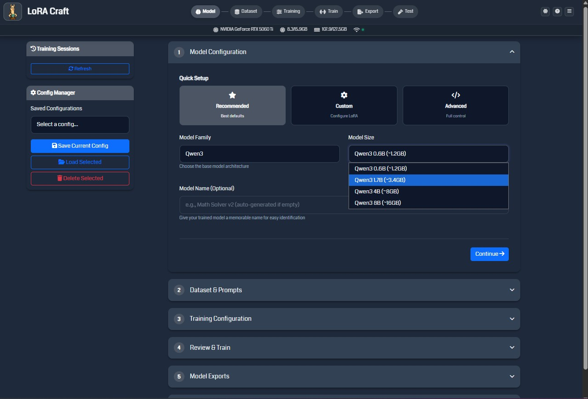

# LoRA Craft

A web-based application for fine-tuning large language models using Low-Rank Adaptation (LoRA) and Group Relative Policy Optimization (GRPO). Built for researchers and developers who need accessible LLM training on consumer hardware.



## Features

### Core Capabilities
- **GRPO/GSPO Training**: Reinforcement learning algorithms for LLM fine-tuning
- **Multi-Model Support**: Compatible with Qwen3, LLaMA 3.2, and Phi-4 model families
- **Real-Time Monitoring**: Live training metrics with WebSocket streaming
- **Session Management**: Train multiple models simultaneously with unique display names
- **Automatic Memory Management**: Batch size optimization based on available VRAM
- **Export Flexibility**: Export to SafeTensors, GGUF, and HuggingFace formats

### User Interface
- **Web Interface**: Clean, responsive design with dark/light theme support
- **Visual Training Pipeline**: Step-by-step workflow from model selection to export
- **Real-Time System Monitoring**: Live GPU, VRAM, and RAM usage indicators
- **Configuration Manager**: Save, load, and manage training configurations
- **Interactive Charts**: Visualize loss, rewards, and learning rate during training

### Technical Features
- **Unsloth Optimization**: 2x faster training with 50% less memory usage
- **Flash Attention Support**: Hardware-accelerated attention mechanisms
- **Mixed Precision Training**: FP16/BF16 support for efficient computation
- **Gradient Checkpointing**: Trade compute for memory efficiency
- **Custom Reward Functions**: Binary, regex, and numerical reward systems

## System Requirements

### Minimum Requirements
- **GPU**: NVIDIA GPU with 6GB+ VRAM (CUDA 11.8+)
- **RAM**: 16GB system memory
- **Storage**: 20GB free space for models and checkpoints
- **OS**: Windows 10/11, Ubuntu 20.04+, or macOS 12+
- **Python**: 3.11 or higher

### Recommended Specifications
- **GPU**: NVIDIA RTX 3070 or better (8GB+ VRAM)
- **RAM**: 32GB system memory
- **Storage**: 50GB+ SSD space
- **Internet**: Stable connection for downloading models

## Installation

### 1. Clone the Repository
```bash
git clone https://github.com/yourusername/grpo_gui.git
cd grpo_gui
```

### 2. Create Virtual Environment
```bash
python -m venv .venv

# Windows
.venv\Scripts\activate

# Linux/macOS
source .venv/bin/activate
```

### 3. Install PyTorch with CUDA
```bash
# For CUDA 11.8
pip install torch torchvision torchaudio --index-url https://download.pytorch.org/whl/cu118

# For CUDA 12.1
pip install torch torchvision torchaudio --index-url https://download.pytorch.org/whl/cu121
```

### 4. Install Dependencies
```bash
pip install -r requirements.txt
```

## Quick Start

### Launch the Application
```bash
python flask_app.py
```

Navigate to `http://localhost:5000` in your web browser.

### Basic Training Workflow

1. **Model Selection**: Choose from Qwen3, LLaMA, or Phi-4 models
2. **Dataset Configuration**: Select a pre-configured dataset or upload your own
3. **Field Mapping**: Map dataset columns to reward function fields (auto-suggested)
4. **Reward Selection**: Choose appropriate reward preset with field validation
5. **Training Parameters**: Adjust epochs, batch size, and learning rate
6. **Start Training**: Monitor real-time progress and metrics
7. **Export Model**: Download your fine-tuned model in your preferred format

## Usage Guide

### Web Interface Navigation

#### Model Configuration
- Select base model from dropdown (organized by family)
- Configure LoRA parameters (rank, alpha, target modules)
- Choose quantization settings for memory optimization

#### Dataset Setup
- **Pre-configured Datasets**: Alpaca, Dolly, OpenOrca, and more
- **Custom Datasets**: Upload JSON, CSV, or Parquet files
- **Field Mapping**: Automatic field mapping with visual validation and preview
- **Template System**: Apply chat templates with special tokens

#### Training Configuration
- **Algorithm Selection**: GRPO (token-level) or GSPO (sequence-level)
- **Hyperparameters**: Learning rate, batch size, epochs
- **Optimization**: Flash attention, gradient checkpointing
- **Reward Functions**: Field mapping with 13 curated presets and compatibility scoring

#### Monitoring & Management
- **Real-Time Metrics**: Loss, rewards, gradients, learning rate
- **Training Logs**: Detailed console output
- **Session Control**: Pause, resume, or stop training
- **Resource Usage**: Monitor GPU/RAM utilization

### Command Line Options

```bash
# Standard launch
python flask_app.py

# Debug mode with verbose logging
python flask_app.py --debug

# Headless mode with configuration file
python flask_app.py --headless --config configs/training.json

# Custom port
python flask_app.py --port 8080

# Create example configuration
python flask_app.py --create-example-config
```

## Additional Features

### GRPO vs GSPO Algorithms

**GRPO (Group Relative Policy Optimization)**
- Token-level importance weighting
- Suitable for tasks requiring fine-grained control
- Default choice for most fine-tuning scenarios

**GSPO (Group Sequence Policy Optimization)**
- Sequence-level importance weighting
- Developed by Qwen/Alibaba team
- Better stability for longer sequences

### Custom Reward Functions

LoRA Craft includes a reward system with **13 curated presets** designed for different training tasks. Each reward function combines multiple scoring components to evaluate model outputs.

**Available Reward Categories:**
- **Mathematics & Science**: Equation solving, scientific calculations
- **Programming**: Code generation, algorithm implementation
- **Language & Writing**: Documentation, Q&A, instructions
- **Data & Analysis**: Insights, technical signals, reasoning
- **Formatting**: Markdown, citations, structured output

**Key Features:**
- Field mapping with auto-detection
- Visual compatibility scoring (0-100%)
- Live preview of data transformation
- Preset library with examples and difficulty levels

### Reward Function Field Mapping

LoRA Craft features a field mapping system that automatically connects your dataset columns to reward function requirements.

#### How Field Mapping Works

1. **Automatic Detection**: When you select a dataset, the system analyzes column names
2. **Suggested Mappings**: Fuzzy matching algorithm suggests field mappings
3. **Visual Confirmation**: Preview how your data will be processed before training
4. **Compatibility Scoring**: See how well your dataset matches the reward function (0-100%)

#### Using Field Mapping

**Step 1: Select Your Dataset**
- Load any dataset with instruction/response format
- System detects available columns automatically

**Step 2: Choose a Reward Preset**
- Browse categorized presets (Math, Code, Language, etc.)
- View example inputs/outputs for each preset
- See required vs. optional fields

**Step 3: Map Fields**
- Click "Map Fields" button when selecting a reward
- **Auto-Map**: One-click automatic field mapping
- **Manual**: Adjust mappings via dropdown menus
- **Preview**: See actual data transformation in real-time

**Step 4: Validate & Confirm**
- Compatibility bar shows mapping quality (green = good, red = issues)
- Warning alerts for missing required fields
- Confidence scores for each mapping

#### Field Mapping Interface

The field mapping modal shows:
- **Dataset Columns** (left): Your actual column names
- **Arrow Indicator**: Visual connection between fields
- **Reward Fields** (right): Expected field names with descriptions
- **Status Badges**:
  - ✓ **Mapped** (green) - Successfully connected
  - ✗ **Missing** (red) - Required field not found
  - ⚠ **Optional** (yellow) - Optional field available
- **Live Preview**: Sample data showing actual transformations

#### Common Field Mappings

| Your Dataset Column | Maps To | Reward Field |
|---------------------|---------|--------------|
| `prompt`, `question`, `input` | → | `instruction` |
| `output`, `answer`, `completion` | → | `response` |
| `expected`, `target`, `ground_truth` | → | `reference` (optional) |

#### Tips for Best Results

- **Clear Column Names**: Use descriptive names in your dataset
- **Check Examples**: Review reward preset examples before mapping
- **Validate Mapping**: Always check the preview before training
- **Save Configs**: Field mappings are saved with training configurations
- **High Compatibility**: Aim for 80%+ compatibility score

#### Supported Reward Presets

**Mathematics & Science**
- **Mathematical Problem Solving** - Equations, calculations with boxed answers
- **Scientific Calculation** - Physics, chemistry formulas with numerical precision

**Programming**
- **Code Generation** - Python, JavaScript with syntax validation
- **Algorithm Implementation** - Data structures, algorithmic logic

**Language & Writing**
- **Technical Documentation** - API docs, guides with proper structure
- **Explanatory Q&A** - Detailed explanations with examples
- **Step-by-Step Instructions** - Tutorials, how-tos with numbered steps

**Data & Analysis**
- **Data Analysis** - Metrics, insights with numerical evidence
- **Technical Analysis Signal** - Trading signals (BUY/SELL/HOLD)
- **Logical Reasoning** - Deductive logic with conclusion markers
- **Chain of Thought** - Multi-step reasoning process

**Formatting**
- **Markdown Formatting** - Headers, lists, code blocks, emphasis
- **Citation Format** - Academic references with authors and years

Each preset includes:
- **Field requirements** (instruction, response, reference)
- **Example inputs and outputs**
- **Recommended training settings**
- **Difficulty level** (beginner/intermediate/advanced)

### Template System

Support for various chat templates:
- Alpaca, ChatML, Vicuna formats
- Custom Jinja2 templates
- Special token configuration
- System prompt integration

### Export Formats

**SafeTensors**
- Efficient tensor serialization
- Compatible with HuggingFace ecosystem
- Preserves all LoRA adapter weights

**GGUF (llama.cpp)**
- Quantized formats (Q4_K_M, Q5_K_M, Q8_0)
- Optimized for CPU inference
- Compatible with Ollama and LM Studio

**HuggingFace Hub**
- Direct upload to HF repository
- Automatic model card generation
- Version control support

## API Documentation

### REST Endpoints

| Endpoint | Method | Description |
|----------|--------|-------------|
| `/api/system/info` | GET | System capabilities and status |
| `/api/models` | GET | List available base models |
| `/api/datasets/list` | GET | Available datasets and cache status |
| `/api/training/start` | POST | Initialize training session |
| `/api/training/{id}/status` | GET | Session status and metrics |
| `/api/training/{id}/stop` | POST | Stop active training |
| `/api/export/{id}` | POST | Export trained model |
| `/api/configs/list` | GET | Saved configurations |

### WebSocket Events

**Client Events**
- `join_session`: Subscribe to session updates
- `leave_session`: Unsubscribe from updates
- `request_update`: Request immediate status

**Server Events**
- `training_progress`: Progress percentage
- `training_metrics`: Current metrics object
- `training_log`: Console output
- `training_complete`: Session finished
- `training_error`: Error details

### Configuration Schema

```json
{
  "model_name": "unsloth/Qwen3-1.7B",
  "dataset_path": "yahma/alpaca-cleaned",
  "num_epochs": 3,
  "batch_size": 4,
  "learning_rate": 2e-4,
  "algorithm": "grpo",
  "lora_rank": 16,
  "lora_alpha": 32,
  "lora_target_modules": ["q_proj", "v_proj"],
  "temperature": 0.7,
  "max_length": 512,
  "gradient_checkpointing": true,
  "use_flash_attention": false,
  "display_name": "My Fine-tuned Model"
}
```

## Troubleshooting

### Common Issues

**CUDA Out of Memory**
- Reduce batch size in training configuration
- Enable gradient checkpointing
- Use 4-bit quantization for larger models

**Slow Training Speed**
- Enable Flash Attention (requires Ampere GPUs)
- Check CUDA version compatibility
- Ensure GPU drivers are up to date

**Connection Issues**
- Verify firewall settings for port 5000
- Check WebSocket compatibility
- Try different browser if issues persist

### Performance Optimization

1. **Memory Management**
   - Use gradient accumulation for larger effective batch sizes
   - Enable CPU offloading for optimizer states
   - Clear cache between training sessions

2. **Speed Improvements**
   - Enable torch.compile for supported models
   - Use mixed precision training (fp16/bf16)
   - Optimize dataloader workers

3. **Quality Tips**
   - Start with lower learning rates (1e-5 to 5e-4)
   - Use warmup steps for stable training
   - Monitor gradient norms for instability

## License

This project is licensed under the MIT License - see the LICENSE file for details. Use and modify as you wish without restriction!

## Acknowledgments

- **Unsloth**: For efficient training optimizations
- **TRL**, **DeepSeek** & **Qwen** Teams: For GRPO/GSPO/DPO algorithms and implementations
- **HuggingFace**: For model and dataset ecosystem
