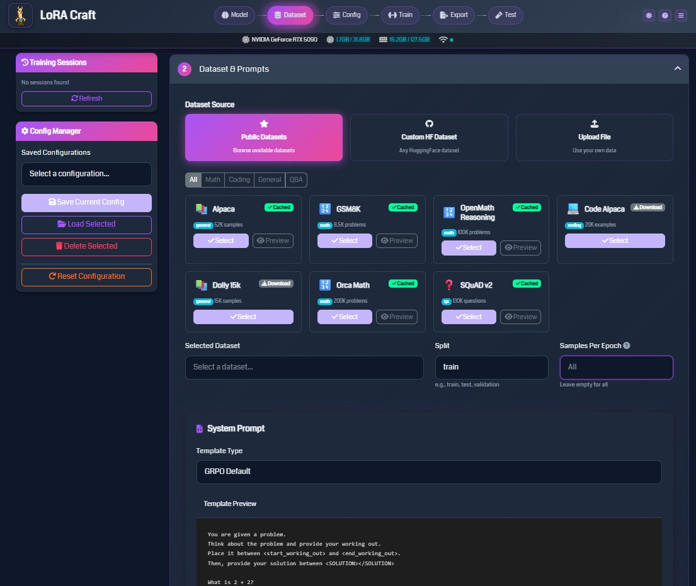
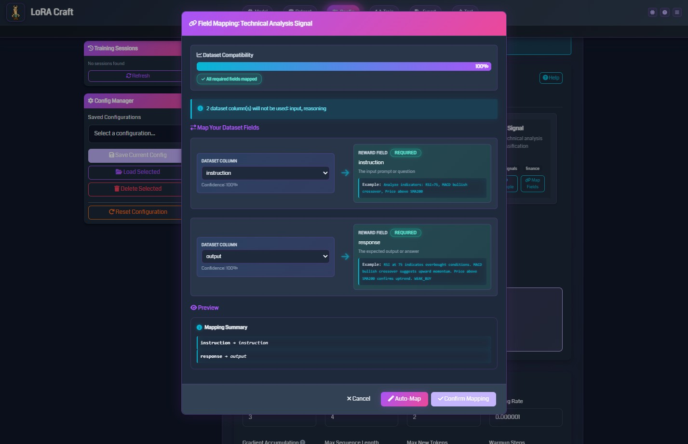

<div align="center">
  
  <h1>LoRA Craft</h1>
  <p>Craft your own LoRA adapters with LoRA Craft - A web-based interface for fine-tuning language models using GRPO (Group Relative Policy Optimization)</p>
</div>

---

## Table of Contents

1. [Overview](#overview)
2. [Prerequisites](#prerequisites)
3. [Installation](#installation)
   - [Docker Installation (Recommended)](#docker-installation-recommended)
   - [Native Installation](#native-installation)
4. [Quick Start](#quick-start)
5. [User Guide](#user-guide)
   - [Step 1: Model Selection](#step-1-model-selection)
   - [Step 2: Dataset Configuration](#step-2-dataset-configuration)
   - [Step 3: Training Configuration](#step-3-training-configuration)
   - [Step 4: Reward Functions](#step-4-reward-functions)
   - [Step 5: Training & Monitoring](#step-5-training--monitoring)
   - [Step 6: Model Export](#step-6-model-export)
   - [Step 7: Testing Models](#step-7-testing-models)
6. [Key Concepts](#key-concepts)
7. [Troubleshooting](#troubleshooting)
8. [Technical Reference](#technical-reference)
9. [Appendix](#appendix)

---

## Overview

LoRA Craft is a web-based application that enables fine-tuning of large language models without requiring extensive machine learning expertise. The application uses GRPO (Group Relative Policy Optimization) to train models through reinforcement learning with custom reward functions.

### What Can You Do With LoRA Craft?

- **Fine-tune models for specific tasks**: Math reasoning, code generation, question answering, and general instruction-following
- **Use pre-configured datasets**: Access popular datasets like Alpaca, GSM8K, OpenMath, and Code Alpaca
- **Upload custom datasets**: Train on your own data in JSON, JSONL, CSV, or Parquet formats
- **Monitor training in real-time**: Track loss, rewards, KL divergence, and other metrics through interactive charts
- **Export trained models**: Convert models to GGUF format for use with llama.cpp, Ollama, or LM Studio

### Key Benefits

- **No-code interface**: Configure and train models through a web browser
- **Preset reward functions**: Choose from pre-built reward functions for common tasks (math, coding, reasoning)
- **Real-time monitoring**: WebSocket-based live updates during training
- **Configuration management**: Save and load training configurations for reproducibility
- **GPU monitoring**: Track VRAM usage and system resources during training

---

## Prerequisites

### Hardware Requirements

**GPU Mode (Recommended):**
- **GPU**: NVIDIA GPU with CUDA support
  - 8GB VRAM: Small models (0.6B - 1.7B parameters)
  - 12GB VRAM: Medium models (3B - 4B parameters)
  - 16GB+ VRAM: Large models (7B - 8B parameters)
- **RAM**: Minimum 16GB system memory (32GB+ recommended)
- **Storage**: At least 64GB free disk space for models and datasets

**CPU-Only Mode (Supported):**
- **CPU**: Modern multi-core processor (4+ cores)
- **RAM**: Minimum 16GB system memory (32GB+ strongly recommended)
- **Storage**: At least 64GB free disk space
- **Note**: Training will be 5-10x slower than GPU mode. Best for development, testing, or small-scale training.

### Software Requirements

- **Operating System**: Windows, Linux, or macOS
- **Python**: Version 3.11 or higher (for native installation)
- **CUDA**: CUDA Toolkit 12.8 or compatible version (GPU mode only)
- **Git**: For cloning the repository
- **Docker**: For Docker installation (optional but recommended)

---

## Installation

**Choose your installation method:**

- **[Docker Installation](#docker-installation-recommended)** (Recommended) - Easiest setup, works on any system
- **[Native Installation](#native-installation)** - Direct installation on your system

### Docker Installation (Recommended)

Docker provides the easiest and most reliable way to run LoRA Craft with all dependencies pre-configured. The Docker setup works on **Windows** (with WSL2), **Linux**, and **macOS**.

#### Why Use Docker?

- **Zero dependency management** - No need to install Python, CUDA, or PyTorch manually
- **Consistent environment** - Works the same on any system
- **Isolated installation** - Won't conflict with other Python projects
- **Easy updates** - Pull latest image and restart
- **Production-ready** - Includes health checks, logging, and volume management
- **CPU/GPU flexibility** - Automatically detects and uses available hardware

#### Prerequisites

**Required (All Systems):**
- **Docker 20.10+** and **Docker Compose 2.0+**

**For GPU Mode (Optional):**
- **NVIDIA GPU** with CUDA support
- **NVIDIA Driver 535+** installed on host
- **NVIDIA Container Toolkit** - See [DOCKER-QUICKSTART.md](DOCKER-QUICKSTART.md) for installation

**For CPU-Only Mode:**
- No additional setup needed - Docker is sufficient
- Recommended: 16GB+ RAM (32GB+ preferred)

#### Quick Start

```bash
# Clone the repository
git clone https://github.com/jwest33/lora_craft.git
cd lora_craft

# Optional: Configure environment
cp .env.example .env
# Edit .env to customize PORT, FLASK_SECRET_KEY, etc.

# Start the application (builds image on first run)
docker compose up -d

# View logs to verify startup
docker compose logs -f

# Access the web interface
# Open browser to http://localhost:5000
```

**First startup takes 5-10 minutes** to download the base image and install dependencies. Subsequent starts are nearly instant.

#### What's Included

The LoRA Craft Docker image provides:

- **NVIDIA CUDA 12.8** runtime with cuDNN 9.7 (works on both GPU and CPU)
- **Python 3.11** with all dependencies pre-installed
- **PyTorch 2.8.0** with CUDA 12.8 support
- **nvidia-smi** utility for GPU monitoring (when GPU available)
- **Automatic GPU/CPU detection** on startup
- **CPU fallback** when GPU not available
- **Persistent volumes** for models, datasets, configs, and outputs
- **Health checks** to monitor application status
- **Optimized training libraries** (Unsloth, Transformers, PEFT, TRL)

**Image size**: ~20GB (includes all ML libraries)

#### Volume Management

Docker automatically creates persistent volumes for your data:

| Host Directory | Container Path | Purpose |
|---------------|----------------|---------|
| `./outputs/` | `/app/outputs` | Trained model checkpoints |
| `./exports/` | `/app/exports` | Exported GGUF models |
| `./configs/` | `/app/configs` | Saved training configurations |
| `./uploads/` | `/app/uploads` | Uploaded dataset files |
| `./logs/` | `/app/logs` | Application logs |

**Named volumes** (stored in Docker):
- `huggingface-cache` - Downloaded models from HuggingFace
- `transformers-cache` - Transformers model cache
- `datasets-cache` - HuggingFace datasets cache
- `torch-cache` - PyTorch cache

**Backup your data**: Simply copy the host directories listed above.

#### Common Docker Commands

```bash
# Start application
docker compose up -d

# Stop application (preserves data)
docker compose down

# View live logs
docker compose logs -f

# Restart after changes
docker compose restart

# Check container status
docker compose ps

# Execute commands in container
docker compose exec lora-craft bash

# Check GPU inside container
docker compose exec lora-craft nvidia-smi

# Rebuild image (after Dockerfile changes)
docker compose build --no-cache
docker compose up -d

# Update to latest version
git pull
docker compose build
docker compose up -d

# Remove everything including volumes (WARNING: deletes all data)
docker compose down -v
```

#### Platform-Specific Notes

**Windows (Docker Desktop with WSL2)**:
- GPU support requires WSL2 backend (enabled by default)
- No need to install CUDA Toolkit on Windows host
- NVIDIA Driver must be installed on Windows (not in WSL2)
- Docker Desktop automatically includes NVIDIA Container Toolkit

**Linux**:
- Requires NVIDIA Container Toolkit installation
- See [DOCKER-QUICKSTART.md](DOCKER-QUICKSTART.md) for setup instructions
- Use `sudo` for Docker commands or add user to docker group

**macOS**:
- GPU acceleration not available (no NVIDIA GPU support)
- **CPU-only mode** - works for development and testing
- Training will be 5-10x slower than GPU mode
- Recommended for small models (Qwen3-0.6B, Qwen3-1.7B)
- For production training, consider using cloud GPU instance

**CPU Mode Detection:**

The application automatically detects available hardware on startup:
- **With GPU**: Uses CUDA acceleration and Unsloth optimizations
- **Without GPU**: Falls back to CPU mode with standard PyTorch

Check logs after startup to see which mode is active:
```bash
docker compose logs lora-craft | grep -i "gpu\|cuda\|cpu mode"
```

For **detailed Docker setup, CPU mode configuration, troubleshooting, and platform-specific instructions**, see **[DOCKER-QUICKSTART.md](DOCKER-QUICKSTART.md)**.

---

### Native Installation

For users who prefer to install directly on their system.

#### Step 1: Clone the Repository

```bash
git clone https://github.com/jwest33/lora_craft.git
cd lora_craft
```

#### Step 2: Install PyTorch

**For GPU (CUDA 12.8):**
```bash
pip install torch torchvision --index-url https://download.pytorch.org/whl/cu128
```

**For CPU-only:**
```bash
pip install torch torchvision --index-url https://download.pytorch.org/whl/cpu
```

For other CUDA versions or more options, visit [PyTorch's installation page](https://pytorch.org/get-started/locally/).

#### Step 3: Install Dependencies

**For GPU mode:**
```bash
pip install -r requirements.txt
```

**For CPU-only mode:**
```bash
# Install PyTorch CPU first (if not done in Step 2)
pip install torch torchvision --index-url https://download.pytorch.org/whl/cpu

# Comment out GPU-specific packages in requirements.txt:
# - unsloth, unsloth_zoo
# - bitsandbytes
# - xformers
# - triton-windows (Windows only)
# Then install:
pip install -r requirements.txt
```

This will install all required packages including:
- Unsloth (optimized training framework, GPU-only)
- Transformers and PEFT (model handling)
- Flask and SocketIO (web interface)
- Training utilities (accelerate, TRL, bitsandbytes)

### Step 4: Verify Installation

Check that PyTorch is working:

**GPU Mode:**
```python
python -c "import torch; print(f'CUDA available: {torch.cuda.is_available()}')"
```
You should see `CUDA available: True`.

**CPU Mode:**
```python
python -c "import torch; print(f'PyTorch version: {torch.__version__}')"
```
You should see the PyTorch version printed.

---

## Quick Start

### Starting the Application

1. Navigate to the project directory:
   ```bash
   cd lora_craft
   ```

2. Start the Flask server:
   ```bash
   python flask_app.py
   ```

3. Open your web browser and navigate to:
   ```
   http://localhost:5000
   ```

### Basic Workflow

1. **Select a model** from the Model tab (e.g., Qwen3 1.7B)
2. **Choose a dataset** from the Dataset tab (e.g., GSM8K for math)
3. **Configure training parameters** in the Config tab
4. **Select a reward function** matching your task
5. **Start training** and monitor progress in real-time
6. **Export your model** when training completes
7. **Test the model** with sample prompts

---

## User Guide

### Step 1: Model Selection


The Model Configuration page allows you to select the base model for fine-tuning.

#### Quick Setup Options

- **Recommended**: Uses best default settings for most use cases
- **Custom**: Configure LoRA parameters (rank, alpha, dropout)
- **Advanced**: Full control over all training parameters

#### Model Family

Choose from several model families:
- **Qwen3**: Efficient models ranging from 0.6B to 8B parameters
- **Llama**: Popular open-source models
- **Mistral**: High-quality instruction-following models
- **Phi**: Microsoft's compact models

#### Model Size Selection

Select a model size based on your available VRAM. Examples:
- **0.6B - 1.7B**: Works on 4GB+ VRAM
- **3B - 4B**: Requires 8GB+ VRAM
- **7B - 8B**: Requires 16GB+ VRAM

### Step 2: Dataset Configuration



Configure the training data for your model.

#### Dataset Source Options

1. **Public Datasets**: Browse curated datasets from HuggingFace
   - Filter by category: Math, Coding, General, Q&A
   - View dataset size and sample count
   - Preview dataset samples before training

2. **Custom HF Dataset**: Enter any HuggingFace dataset path
   - Format: `username/dataset-name`
   - Specify split (train, test, validation)

3. **Upload File**: Use your own data
   - Supported formats: JSON, JSONL, CSV, Parquet
   - Maximum size: 10GB

#### Popular Datasets

- **Alpaca** (52K samples): General instruction-following
- **GSM8K** (8.5K problems): Grade school math reasoning
- **OpenMath Reasoning** (100K problems): Advanced math problems
- **Code Alpaca** (20K examples): Code generation tasks
- **Dolly 15k** (15K samples): Diverse instruction tasks
- **Orca Math** (200K problems): Math word problems
- **SQuAD v2** (130K questions): Question answering

#### Field Mapping

Map your dataset columns to expected fields:
- **Instruction**: The input prompt or question
- **Response**: The expected output or answer

The system auto-detects common field names (question, answer, prompt, completion, etc.).

#### System Prompt Configuration


Define the instruction format for your model:
- **Template Type**: Choose GRPO Default or create custom templates
- **System Prompt**: Instructions given to the model
- **Reasoning Markers**: Tags to structure model thinking process
- **Solution Markers**: Tags to identify final answers

### Step 3: Training Configuration

Configure hyperparameters for the training process.

#### Essential Parameters

**Training Duration**
- **Epochs**: Number of complete passes through the dataset (typical: 1-5)
- **Samples Per Epoch**: Limit samples per epoch, or use "All" for full dataset

**Batch Settings**
- **Batch Size**: Samples processed simultaneously (typical: 1-4)
- **Gradient Accumulation Steps**: Effective batch size multiplier (typical: 4-8)
  - Effective batch size = batch_size × gradient_accumulation_steps

**Learning Rate**
- **Learning Rate**: Step size for model updates (typical: 5e-5 to 5e-4)
- **Warmup Steps**: Gradual learning rate increase at start (typical: 10-100)
- **LR Scheduler**: Learning rate adjustment strategy
  - `constant`: No change during training
  - `linear`: Linear decay from peak to zero
  - `cosine`: Smooth cosine decay

**Optimization**
- **Optimizer**: Algorithm for updating model weights
  - `paged_adamw_32bit`: Memory-efficient (recommended)
  - `adamw_8bit`: More memory-efficient
- **Weight Decay**: Regularization to prevent overfitting (typical: 0.001-0.01)
- **Max Gradient Norm**: Gradient clipping threshold (typical: 0.3-1.0)

#### GRPO-Specific Parameters

- **KL Penalty**: Prevents model from deviating too far from base model (typical: 0.01-0.1)
- **Clip Range**: PPO-style clipping for stable training (typical: 0.2)
- **Importance Sampling Level**: Token-level or sequence-level weighting

#### LoRA Parameters

- **LoRA Rank**: Controls adapter capacity (typical: 8-32)
- **LoRA Alpha**: Scaling factor for adapter (typically 2x rank)
- **LoRA Dropout**: Regularization to prevent overfitting (typical: 0.0-0.1)

#### Generation Parameters

- **Max Sequence Length**: Maximum input length in tokens (typical: 1024-4096)
- **Max New Tokens**: Maximum generated response length (typical: 256-1024)
- **Temperature**: Randomness in generation (0.7 = balanced, lower = deterministic)
- **Top-P**: Nucleus sampling threshold (typical: 0.9-0.95)

#### Pre-training Phase

Optional supervised fine-tuning phase before GRPO:
- **Enabled**: Toggle pre-training on/off
- **Epochs**: Number of pre-training epochs (typical: 1-2)
- **Max Samples**: Limit pre-training samples (or use "All")
- **Learning Rate**: Separate learning rate for pre-training (typical: 5e-5)

Pre-training helps the model learn output formatting before reinforcement learning.

### Step 4: Reward Functions


Reward functions evaluate model outputs and guide training. Choose functions that match your task.

#### Reward Function Categories

**Algorithm Implementation**
- Rewards correct algorithm implementation with efficiency considerations
- Use for: Code generation, algorithm design

**Chain of Thought**
- Rewards step-by-step reasoning processes
- Use for: Math problems, logical reasoning, complex analysis

**Citation Format**
- Rewards proper citation formatting (APA/MLA style)
- Use for: Academic writing, research tasks

**Code Generation**
- Rewards well-formatted code with proper syntax and structure
- Use for: Programming tasks, code completion

**Concise Summarization**
- Rewards accurate, concise summaries that capture key points
- Use for: Text summarization, data reporting

**Creative Writing**
- Rewards engaging text with good flow and vocabulary
- Use for: Content generation, storytelling

**Math & Science**
- Rewards correct mathematical solutions and scientific accuracy
- Use for: Math problems, scientific reasoning

**Programming**
- Rewards executable, efficient code
- Use for: Software development tasks

**Reasoning**
- Rewards logical reasoning and inference
- Use for: General problem-solving

**Question Answering**
- Rewards accurate, relevant answers
- Use for: Q&A systems, information retrieval

#### Configuring Reward Functions



1. **Select Algorithm Type**: GRPO (standard) or GSPO (sequence-level)

2. **Choose Reward Source**:
   - **Quick Start**: Auto-configured based on dataset
   - **Preset Library**: Browse categorized reward functions
   - **Custom Builder**: Create custom reward logic (advanced)

3. **Map Dataset Fields**:
   - **Instruction**: Field containing the input prompt
   - **Response**: Field containing the expected output
   - Additional fields may be required depending on the reward function

4. **Test Reward**: Verify reward function works with sample data before training

### Step 5: Training & Monitoring


Once training starts, monitor progress through real-time metrics.

#### Training Metrics Dashboard

**Top Metrics Bar**
- **KL Divergence**: Measures model deviation from base model (lower is more conservative)
- **Completion Length**: Average length of generated responses
- **Clipped Ratio**: Percentage of updates clipped by PPO (indicates training stability)
- **Clip Reason**: Whether clipping is due to min or max bounds
- **Grad Norm**: Gradient magnitude (monitors training health)

**Reward Metrics Chart**
- **Mean Reward**: Average reward across training samples
- **Reward Std**: Standard deviation of rewards (measures consistency)
- Tracks how well the model is learning to maximize rewards

**Training Loss Chart**
- **Training Loss**: Primary optimization objective
- **Validation Loss**: Performance on held-out data (if validation set provided)
- Both should decrease over time

**KL Divergence Chart**
- Tracks how much the model diverges from the base model
- Should remain relatively stable (controlled by KL penalty)

**Completion Length Statistics**
- **Mean Length**: Average response length
- **Min Length**: Shortest response
- **Max Length**: Longest response
- Helps identify if model is generating appropriate response lengths

**Policy Clip Ratios**
- **Target Mean**: Desired clip ratio
- **Clip Mean**: Actual clip ratio
- **Clip Median**: Median clip ratio
- Indicates training stability (high clipping = aggressive updates)

**Learning Rate Schedule**
- Shows learning rate over training steps
- Helps verify scheduler configuration

#### Training Controls

- **Stop Training**: Gracefully halt training and save current checkpoint
- **View Logs**: Access detailed training logs
- **Session Management**: Track multiple training sessions

#### Training Sessions

The left sidebar shows all training sessions:
- Active sessions show real-time status
- Completed sessions remain available for review
- Click a session to view its metrics and model path

### Step 6: Model Export

After training completes, export your model for deployment.

#### Export Formats

**HuggingFace Format**
- Standard format for Transformers library
- Includes base model + LoRA adapter
- Location: `outputs/<session_id>/`

**GGUF Format**
- Optimized format for llama.cpp, Ollama, LM Studio
- Multiple quantization levels available:
  - **Q4_K_M**: 4-bit quantization (balanced)
  - **Q5_K_M**: 5-bit quantization (higher quality)
  - **Q8_0**: 8-bit quantization (best quality)
  - **F16**: 16-bit floating point (no quantization)
- Location: `exports/<session_id>/`

#### Quantization Options

Quantization reduces model size for deployment:
- **Q4_K_M**: ~4GB for 7B model (recommended for most users)
- **Q5_K_M**: ~5GB for 7B model (better quality)
- **Q8_0**: ~8GB for 7B model (minimal quality loss)
- **F16**: ~14GB for 7B model (no quality loss)

#### Using Exported Models

**With llama.cpp**
```bash
./main -m exports/<session_id>/model-q4_k_m.gguf -p "Your prompt here"
```

**With Ollama**
```bash
ollama create my-model -f exports/<session_id>/Modelfile
ollama run my-model
```

**With LM Studio**
- Open LM Studio
- Navigate to "Local Models"
- Click "Import" and select your GGUF file

### Step 7: Testing Models


Test your fine-tuned model with custom prompts.

#### Interactive Testing

1. **Select Model**: Choose from trained models or active training sessions
2. **Enter Prompt**: Type or paste your test question
3. **Configure Generation**:
   - **Temperature**: Control randomness (0.1 = deterministic, 1.0 = creative)
   - **Max Tokens**: Maximum response length
   - **Top-P**: Nucleus sampling threshold
4. **Generate**: Click "Test Model" to generate response

#### Batch Testing

Test multiple prompts at once:
1. Upload a file with test prompts (one per line)
2. Configure generation parameters
3. Run batch test
4. Export results to JSON or CSV

#### Evaluation with Reward Functions

Evaluate model outputs using the same reward functions from training:
1. Select reward function
2. Enter prompt and expected response
3. Generate model output
4. View reward score and feedback

This helps quantify model improvement on your specific task.

---

## Key Concepts

### What is GRPO (Group Relative Policy Optimization)?

GRPO is a reinforcement learning algorithm for training language models. Unlike supervised learning (which simply teaches the model to imitate examples), GRPO teaches the model to maximize rewards.

**How GRPO Works:**
1. Model generates multiple responses for each prompt
2. Reward function scores each response
3. Model learns to increase probability of high-reward responses
4. Model learns to decrease probability of low-reward responses

**Benefits:**
- Models learn to optimize for specific objectives (correctness, format, style)
- Better generalization than pure supervised learning
- Can improve beyond training data quality

**GRPO vs Other Algorithms:**
- **GRPO**: Token-level importance weighting (standard)
- **GSPO**: Sequence-level optimization (simpler, less granular)

### What are LoRA Adapters?

LoRA (Low-Rank Adaptation) is a parameter-efficient fine-tuning method.

**Key Concepts:**
- Instead of updating all model parameters (billions), LoRA adds small "adapter" layers
- Adapters are typically 1-2% the size of the full model
- Base model remains frozen, only adapters are trained
- Multiple adapters can be applied to the same base model

**Benefits:**
- **Memory Efficient**: Train on consumer GPUs (4-8GB VRAM)
- **Fast Training**: Fewer parameters to update
- **Easy Sharing**: Adapter files are small (typically 10-100MB)
- **Modular**: Switch adapters for different tasks

**LoRA Parameters:**
- **Rank**: Number of dimensions in adapter (higher = more capacity, slower training)
- **Alpha**: Scaling factor (controls adapter influence)
- **Dropout**: Regularization to prevent overfitting

### Understanding Reward Functions

Reward functions are Python functions that evaluate model outputs and return scores.

**Components of a Reward Function:**
1. **Input**: Model's generated response + reference data
2. **Evaluation Logic**: Checks correctness, format, quality
3. **Output**: Numerical score (typically 0.0 to 1.0)

**Example: Math Reward Function**
```python
def math_reward(response, expected_answer):
    # Extract answer from response
    model_answer = extract_solution(response)

    # Check correctness
    if model_answer == expected_answer:
        return 1.0  # Correct
    else:
        return 0.0  # Incorrect
```

**Types of Reward Functions:**
- **Exact Match**: Binary reward (correct/incorrect)
- **Partial Credit**: Gradual scoring (0.0 to 1.0)
- **Multi-Component**: Combines multiple criteria (correctness + format + efficiency)
- **Heuristic**: Rule-based evaluation
- **Model-Based**: Uses another model to evaluate quality

**Best Practices:**
- Start with simple, interpretable reward functions
- Ensure rewards align with your desired behavior
- Test rewards on sample data before training
- Monitor reward distributions during training

### Understanding System Prompts

System prompts define the instruction format and expected output structure.

**Components:**
- **System Message**: High-level instructions for the model
- **Instruction Template**: How to format input prompts
- **Response Template**: Expected output structure
- **Special Markers**: Tags for reasoning and solutions

**Example System Prompt (GRPO Default):**
```
You are given a problem.
Think about the problem and provide your working out.
Place it between <start_working_out> and <end_working_out>.
Then, provide your solution between <SOLUTION></SOLUTION>
```

**Why Use Structured Outputs?**
- Separates reasoning from final answer
- Makes reward function evaluation easier
- Improves model interpretability
- Enables extraction of specific components

---

## Troubleshooting

### CPU vs GPU Mode

**Note**: LoRA Craft automatically detects and uses available hardware. If you see "CPU Mode" in the logs but have an NVIDIA GPU, see the GPU troubleshooting section below.

**Expected CPU Mode Indicators:**
- Log message: `x No GPU detected - running in CPU mode`
- Log message: `x Unsloth optimizations: DISABLED (requires CUDA)`
- System status shows: "CPU Mode (No GPU Detected)"

**This is normal if:**
- You don't have an NVIDIA GPU
- Running on macOS
- Intentionally using CPU mode for testing
- NVIDIA Container Toolkit not installed (Docker)

### Docker-Specific Issues

#### GPU Not Detected in Container (But You Have a GPU)

**Symptom**: Container logs show "CPU Mode" or "CUDA Available: False" even though you have an NVIDIA GPU

**Solutions:**

1. **Verify GPU works with Docker**:
   ```bash
   docker run --rm --gpus all nvidia/cuda:12.8.0-base-ubuntu22.04 nvidia-smi
   ```
   If this fails, your Docker GPU setup needs configuration.

2. **Check docker-compose.yml** has correct GPU configuration:
   ```yaml
   runtime: nvidia
   environment:
     - NVIDIA_VISIBLE_DEVICES=all
     - NVIDIA_DRIVER_CAPABILITIES=compute,utility
   ```

3. **For Docker Desktop** (Windows/macOS):
   - Restart Docker Desktop
   - Settings → Resources → WSL Integration (ensure enabled)
   - Verify NVIDIA driver installed on Windows host

4. **For Linux**:
   - Ensure NVIDIA Container Toolkit installed
   - Run: `sudo nvidia-ctk runtime configure --runtime=docker`
   - Restart Docker: `sudo systemctl restart docker`

#### Container Won't Start - Entrypoint Error

**Symptom**: "exec /app/src/entrypoint.sh: no such file or directory"

**Cause**: Line ending issues when building on Windows

**Solution**:
```bash
# Rebuild without cache
docker compose build --no-cache
docker compose up -d
```

The Dockerfile automatically fixes line endings, so rebuilding should resolve this.

### GPU Memory Issues

**Problem**: "CUDA out of memory" error during training

**Solutions:**
1. Reduce batch size to 1
2. Increase gradient accumulation steps (maintains effective batch size)
3. Reduce max sequence length (e.g., 2048 → 1024)
4. Use smaller model (e.g., 1.7B instead of 4B)
5. Enable gradient checkpointing (trades compute for memory)
6. Use 8-bit or 4-bit quantization (reduces memory usage)

### Training Not Starting

**Problem**: Training session created but doesn't start

**Solutions:**
1. Check logs folder for error messages (`logs/`)
2. Verify dataset downloaded successfully (check `cache/` folder)
3. Ensure reward function is properly configured
4. Check that all required fields are mapped
5. Restart the Flask server and try again

### Dataset Loading Errors

**Problem**: "Failed to load dataset" error

**Solutions:**
1. Verify dataset name is correct (case-sensitive)
2. Check internet connection for HuggingFace downloads
3. For uploaded files, verify format:
   - JSON: Must be list of objects or object with data field
   - JSONL: One JSON object per line
   - CSV: Must have column headers
   - Parquet: Standard Apache Parquet format
4. Ensure instruction and response fields exist in dataset

### Slow Training Speed

**Problem**: Training is slower than expected

**Solutions:**
1. Verify GPU is being used: Check system monitoring (top bar should show GPU usage)
2. Reduce gradient accumulation steps (increases update frequency)
3. Enable flash attention if using supported model (Llama, Mistral)
4. Disable gradient checkpointing if memory allows
5. Use larger batch size if VRAM permits
6. Check that CUDA and PyTorch are properly installed

### Model Generation Quality Issues

**Problem**: Model outputs are nonsensical or low quality

**Solutions:**
1. **Check reward signal**: Ensure rewards are varying (not all 0.0 or 1.0)
2. **Increase pre-training epochs**: Model needs to learn format first
3. **Adjust KL penalty**: Lower values allow more deviation from base model
4. **Verify dataset quality**: Check that training data is clean and relevant
5. **Increase training epochs**: Model may need more training time
6. **Check system prompt**: Ensure it clearly describes expected output format
7. **Test with different temperatures**: Lower temperature (0.3-0.5) for more deterministic outputs

### WebSocket Connection Issues

**Problem**: Real-time metrics not updating

**Solutions:**
1. Refresh browser page
2. Check browser console for WebSocket errors (F12)
3. Verify Flask server is running
4. Check firewall settings (port 5000 must be accessible)
5. Try a different browser (Chrome/Firefox recommended)

### Export Failures

**Problem**: GGUF export fails or produces invalid files

**Solutions:**
1. Ensure training completed successfully
2. Check that model checkpoint exists (`outputs/<session_id>/`)
3. Verify sufficient disk space for export
4. Check logs for llama.cpp converter errors
5. Try exporting with different quantization level

---

## Technical Reference

### API Endpoints

The Flask server provides RESTful API endpoints for programmatic access.

#### Training Endpoints

**Start Training**
```http
POST /api/training/start
Content-Type: application/json

{
  "session_id": "unique-id",
  "config": { ... training configuration ... }
}
```

**Stop Training**
```http
POST /api/training/stop
Content-Type: application/json

{
  "session_id": "session-id-to-stop"
}
```

**List Training Sessions**
```http
GET /api/training/sessions
```

#### Dataset Endpoints

**List Datasets**
```http
GET /api/datasets/list
```

**Upload Dataset**
```http
POST /api/datasets/upload
Content-Type: multipart/form-data

file=@dataset.json
```

**Preview Dataset**
```http
POST /api/datasets/preview
Content-Type: application/json

{
  "path": "tatsu-lab/alpaca",
  "samples": 5
}
```

#### Model Endpoints

**Test Model**
```http
POST /api/models/test
Content-Type: application/json

{
  "model_path": "outputs/session-id/",
  "prompt": "What is 2+2?",
  "temperature": 0.7,
  "max_tokens": 256
}
```

**List Trained Models**
```http
GET /api/models/list
```

**Export Model**
```http
POST /api/exports/create
Content-Type: application/json

{
  "session_id": "session-id",
  "format": "gguf",
  "quantization": "q4_k_m"
}
```

#### Configuration Endpoints

**Save Configuration**
```http
POST /api/configs/save
Content-Type: application/json

{
  "name": "my-config",
  "config": { ... configuration object ... }
}
```

**Load Configuration**
```http
GET /api/configs/load?name=my-config
```

**List Configurations**
```http
GET /api/configs/list
```

### WebSocket Events

Real-time updates are delivered via Socket.IO.

**Connect to Socket**
```javascript
const socket = io('http://localhost:5000');
```

**Subscribe to Training Updates**
```javascript
socket.on('training_update', (data) => {
  console.log('Step:', data.step);
  console.log('Loss:', data.loss);
  console.log('Reward:', data.reward);
});
```

**Subscribe to System Updates**
```javascript
socket.on('system_update', (data) => {
  console.log('GPU Memory:', data.gpu_memory);
  console.log('GPU Utilization:', data.gpu_utilization);
});
```

### Configuration File Format

Saved configurations are stored as JSON in the `configs/` directory.

**Example Configuration:**
```json
{
  "name": "math-reasoning-config",
  "model": {
    "name": "unsloth/Qwen3-1.7B",
    "lora_rank": 16,
    "lora_alpha": 32,
    "lora_dropout": 0.0
  },
  "dataset": {
    "source": "openai/gsm8k",
    "split": "train",
    "instruction_field": "question",
    "response_field": "answer",
    "max_samples": null
  },
  "training": {
    "num_epochs": 3,
    "batch_size": 1,
    "gradient_accumulation_steps": 8,
    "learning_rate": 0.0002,
    "warmup_steps": 10,
    "weight_decay": 0.001,
    "max_grad_norm": 0.3,
    "lr_scheduler_type": "constant",
    "optim": "paged_adamw_32bit",
    "max_sequence_length": 2048,
    "max_new_tokens": 512,
    "temperature": 0.7
  },
  "grpo": {
    "kl_penalty": 0.05,
    "clip_range": 0.2,
    "importance_sampling_level": "token"
  },
  "reward": {
    "type": "preset",
    "preset_name": "math"
  },
  "pre_training": {
    "enabled": true,
    "epochs": 2,
    "max_samples": 100,
    "learning_rate": 0.00005
  }
}
```

### Supported Dataset Formats

**JSON Format**
```json
[
  {
    "instruction": "What is the capital of France?",
    "response": "The capital of France is Paris."
  },
  {
    "instruction": "Solve 2+2",
    "response": "2+2 = 4"
  }
]
```

**JSONL Format**
```jsonl
{"instruction": "What is the capital of France?", "response": "The capital of France is Paris."}
{"instruction": "Solve 2+2", "response": "2+2 = 4"}
```

**CSV Format**
```csv
instruction,response
"What is the capital of France?","The capital of France is Paris."
"Solve 2+2","2+2 = 4"
```

**Parquet Format**
- Standard Apache Parquet files with `instruction` and `response` columns
- Supports nested structures and efficient compression

### Directory Structure

```
lora_craft/
├── cache/              # Cached datasets from HuggingFace
├── configs/            # Saved training configurations
├── core/               # Core training logic
├── docs/               # Documentation and example images
├── exports/            # Exported models (GGUF, etc.)
├── logs/               # Application and training logs
├── outputs/            # Training outputs (model checkpoints)
├── routes/             # Flask API routes
├── services/           # Business logic services
├── static/             # Static web assets (CSS, JS, images)
├── templates/          # HTML templates
├── uploads/            # Uploaded dataset files
├── utils/              # Utility functions
├── websockets/         # WebSocket handlers
├── flask_app.py        # Application entry point
├── app_factory.py      # Flask application factory
├── constants.py        # Application constants
└── requirements.txt    # Python dependencies
```

---

## Appendix

### Glossary

**Adapter**: Small trainable module added to a frozen base model (see LoRA)

**Base Model**: Pre-trained language model before fine-tuning

**Batch Size**: Number of samples processed simultaneously during training

**CUDA**: NVIDIA's parallel computing platform for GPU acceleration

**Epoch**: One complete pass through the entire training dataset

**Fine-tuning**: Training a pre-trained model on new data for a specific task

**GGUF**: File format for quantized models (used by llama.cpp ecosystem)

**Gradient Accumulation**: Technique to simulate larger batch sizes with limited memory

**Gradient Clipping**: Technique to prevent exploding gradients by limiting their magnitude

**GRPO**: Group Relative Policy Optimization (reinforcement learning algorithm)

**KL Divergence**: Measure of how much the fine-tuned model differs from the base model

**Learning Rate**: Step size for model parameter updates

**LoRA**: Low-Rank Adaptation (parameter-efficient fine-tuning method)

**Quantization**: Reducing model precision (e.g., from 16-bit to 4-bit) to save memory

**Reinforcement Learning**: Training paradigm where model learns from reward signals

**Reward Function**: Function that evaluates model outputs and assigns scores

**System Prompt**: Instructions that define expected model behavior and output format

**Token**: Smallest unit of text processed by language models (roughly 3/4 of a word)

**VRAM**: Video RAM (GPU memory)

**Warmup**: Gradual increase of learning rate at training start

### Additional Resources

**Documentation**
- [Unsloth Documentation](https://docs.unsloth.ai/)
- [HuggingFace Transformers](https://huggingface.co/docs/transformers/)
- [PEFT Library](https://huggingface.co/docs/peft/)
- [TRL (Transformer Reinforcement Learning)](https://huggingface.co/docs/trl/)

**Model Sources**
- [HuggingFace Model Hub](https://huggingface.co/models)
- [Unsloth Model Zoo](https://huggingface.co/unsloth)

**Dataset Sources**
- [HuggingFace Datasets](https://huggingface.co/datasets)
- [OpenAI Datasets](https://github.com/openai)

**Deployment Tools**
- [llama.cpp](https://github.com/ggerganov/llama.cpp)
- [Ollama](https://ollama.ai/)
- [LM Studio](https://lmstudio.ai/)

**Community & Support**
- [GitHub Issues](https://github.com/jwest33/lora_craft/issues)
- [Discussions](https://github.com/jwest33/lora_craft/discussions)

---

**License**: MIT

**Acknowledgments**: Built with Unsloth, HuggingFace Transformers, and Flask.
