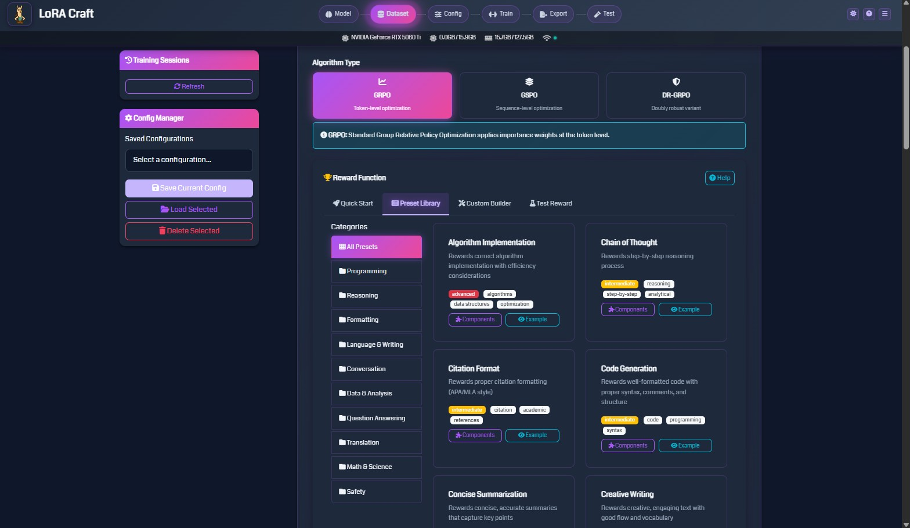

# Features

LoRA Craft combines cutting-edge reinforcement learning with an intuitive interface to make model fine-tuning accessible to everyone.

---

## No-Code Training Interface


Fine-tune language models through your web browser—no Python scripts, no command-line tools, no complex configurations.

**What you get:**
- **Visual configuration**: Point-and-click setup for models, datasets, and training parameters
- **Smart defaults**: Pre-configured settings optimized for common use cases
- **Guided workflow**: Step-by-step process from model selection to deployment
- **Live validation**: Instant feedback on configuration errors before training starts

---

## GRPO Reinforcement Learning {#grpo}

LoRA Craft uses **Group Relative Policy Optimization (GRPO)**, a state-of-the-art reinforcement learning algorithm that goes beyond traditional supervised fine-tuning.

### How GRPO Works

Unlike supervised learning (which teaches models to imitate examples), GRPO teaches models to maximize rewards:

1. **Generate**: Model creates multiple responses for each prompt
2. **Evaluate**: Reward function scores each response based on your criteria
3. **Learn**: Model increases probability of high-reward responses
4. **Iterate**: Process repeats until model consistently produces quality outputs

### Benefits Over Supervised Learning

- **Task optimization**: Models learn to optimize for specific objectives (correctness, format, style)
- **Better generalization**: Goes beyond memorizing training examples
- **Quality improvement**: Can surpass the quality of training data
- **Flexible evaluation**: Use any reward function that matches your goals

### Algorithm Variants

- **GRPO**: Token-level importance weighting (default, most granular)
- **GSPO**: Sequence-level optimization (simpler, faster)
- **OR-GRPO**: Outlier-robust variant (handles noisy rewards better)

---

## Pre-Built Reward Functions



Choose from a library of battle-tested reward functions designed for common tasks, or create your own custom rewards.

### Algorithm Implementation
Rewards correct algorithm implementation with efficiency considerations.
- **Use for**: Code generation, algorithm design, competitive programming

### Chain of Thought Reasoning
Rewards step-by-step reasoning processes and logical deduction.
- **Use for**: Math problems, logical puzzles, complex analysis

### Code Generation
Rewards well-formatted, syntactically correct code with proper structure.
- **Use for**: Programming tasks, code completion, debugging

### Math & Science
Rewards correct mathematical solutions and scientific accuracy.
- **Use for**: STEM education, research assistance, technical Q&A

### Question Answering
Rewards accurate, relevant, and concise answers to questions.
- **Use for**: Information retrieval, customer support, knowledge systems

### Creative Writing
Rewards engaging text with good flow, vocabulary, and originality.
- **Use for**: Content generation, storytelling, marketing copy

### Custom Rewards
Build your own reward functions with Python for any task:
- Citation formatting (APA/MLA)
- Concise summarization
- Translation quality
- Sentiment control
- Domain-specific requirements

---

## Real-Time Training Monitoring


Watch your model learn with live metrics delivered via WebSocket connections.

### Interactive Dashboard

**Top Metrics Bar**
- **KL Divergence**: How much the model deviates from base model
- **Completion Length**: Average response length in tokens
- **Clipped Ratio**: Training stability indicator
- **Gradient Norm**: Model update magnitude

**Live Charts**
- **Reward Metrics**: Mean and standard deviation of rewards over time
- **Training Loss**: Primary optimization objective
- **KL Divergence**: Tracks model deviation throughout training
- **Completion Statistics**: Min, max, and mean response lengths
- **Policy Clip Ratios**: PPO-style clipping metrics
- **Learning Rate Schedule**: Visualize LR changes over steps

### Training Controls

- **Stop Training**: Gracefully halt and save checkpoint
- **View Logs**: Access detailed training output
- **Session Management**: Track multiple concurrent training runs
- **GPU Monitoring**: Real-time VRAM usage and utilization

---

## LoRA Adapter Training

LoRA (Low-Rank Adaptation) enables efficient fine-tuning on consumer hardware.

### How LoRA Works

Instead of updating billions of parameters, LoRA adds small "adapter" layers:
- Adapters are 1-2% the size of the full model
- Base model stays frozen during training
- Multiple adapters can be swapped for different tasks

### Memory Efficiency

Train large models on modest GPUs:
- **8GB VRAM**: 0.6B - 1.7B parameter models
- **12GB VRAM**: 3B - 4B parameter models
- **16GB+ VRAM**: 7B - 8B parameter models

### Configurable Parameters

- **LoRA Rank**: Adapter capacity (8-32 typical)
- **LoRA Alpha**: Scaling factor (usually 2× rank)
- **LoRA Dropout**: Regularization (0.0-0.1 typical)
- **Target Modules**: Which layers to adapt

---

## Flexible Dataset Support


Train on curated public datasets or upload your own custom data.

### Public Dataset Library

Browse 15+ curated datasets with filtering and preview:
- **Math**: GSM8K, OpenMath, Orca Math (350K+ problems)
- **Coding**: Code Alpaca, Programming problems (20K+ examples)
- **General**: Alpaca, Dolly, instruction datasets (100K+ samples)
- **Q&A**: SQuAD v2, TriviaQA (130K+ questions)

### Custom Dataset Upload

Upload your own data in multiple formats:
- **JSON**: List of objects or nested structures
- **JSONL**: One JSON object per line
- **CSV**: Comma-separated with headers
- **Parquet**: Apache Parquet files

**Smart Field Mapping**
- Auto-detects common field names (instruction, response, question, answer)
- Manual mapping for custom schemas
- Preview samples before training

### System Prompt Configuration


Define instruction format and output structure:
- **Template type**: GRPO default or custom formats
- **System message**: High-level model instructions
- **Reasoning markers**: Tags for structured thinking (`<start_working_out>`)
- **Solution markers**: Tags for final answers (`<SOLUTION>`)

---

## Model Export & Deployment

After training, export models in multiple formats for deployment anywhere.

### HuggingFace Format

Standard Transformers-compatible format:
- Base model + LoRA adapter weights
- Compatible with Python inference
- Ready for HuggingFace Hub upload
- Location: `outputs/<session_id>/`

### GGUF Format

Optimized for llama.cpp ecosystem (Ollama, LM Studio):
- **Q4_K_M**: 4-bit quantization (balanced quality/size)
- **Q5_K_M**: 5-bit quantization (higher quality)
- **Q8_0**: 8-bit quantization (minimal quality loss)
- **F16**: 16-bit float (no quantization)

**Size Comparison for 7B Models:**
- Q4_K_M: ~4GB
- Q5_K_M: ~5GB
- Q8_0: ~8GB
- F16: ~14GB

### Deployment Targets

**llama.cpp**
```bash
./main -m model.gguf -p "Your prompt"
```

**Ollama**
```bash
ollama create mymodel -f Modelfile
ollama run mymodel
```

**LM Studio**
Import GGUF files directly through the UI

---

## Configuration Management

Save and reuse training configurations for reproducibility.

**Features:**
- **Save configs**: Store complete training setups with names
- **Load configs**: Quickly restore previous configurations
- **Share configs**: JSON format for team collaboration
- **Version control**: Track configuration changes

**Saved Parameters:**
- Model selection and LoRA settings
- Dataset paths and field mappings
- Training hyperparameters
- Reward function configuration
- System prompt templates

---

## Advanced Training Options

### Pre-Training Phase

Optional supervised fine-tuning before GRPO:
- Helps model learn output format
- Improves GRPO training stability
- Configurable epochs and learning rate
- Can limit samples for quick adaptation

### Hyperparameter Control

Fine-tune training behavior:
- **Batch size**: Memory vs. training speed tradeoff
- **Gradient accumulation**: Simulate larger batches
- **Learning rate scheduling**: Constant, linear, cosine decay
- **KL penalty**: Control model deviation from base
- **Clip range**: PPO-style gradient clipping
- **Warmup steps**: Gradual LR increase at start

### Generation Parameters

Control model outputs during training:
- **Max sequence length**: Input token limit (1024-4096)
- **Max new tokens**: Response length limit (256-1024)
- **Temperature**: Randomness in generation (0.1-1.0)
- **Top-P**: Nucleus sampling threshold (0.9-0.95)

---

## Next Steps

<div class="feature-cta">
  <div>
    <h3>Ready to start training?</h3>
    <p>Follow our quick start guide to fine-tune your first model</p>
  </div>
  <a href="quickstart.html" class="btn-primary">Quick Start →</a>
</div>

<div class="feature-cta">
  <div>
    <h3>See it in action</h3>
    <p>Explore real-world use cases and example configurations</p>
  </div>
  <a href="use-cases.html" class="btn-secondary">Use Cases →</a>
</div>
